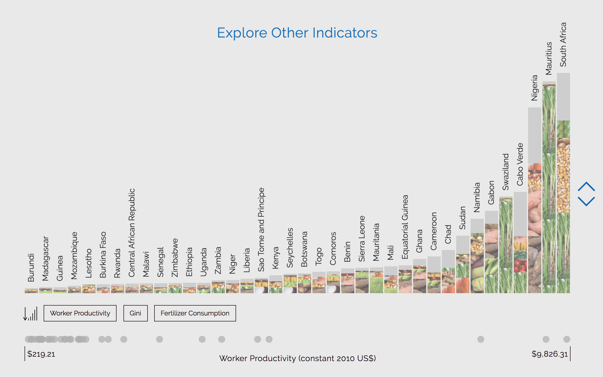

# Agricultural Productivity in sub-Sarahan Africa

## Crop Profiles of Countries in sub-Saharan Africa

This project aims to explore the effect of agricultural investment and productivity on the welfare and equitable share of resources in Africa. 

Created by Aucher Serr as a final project for the Major Studio Fall 2017 course. This project would be nothing without the collaboration of the 2017-2018 MS in Data Visualization cohort at Parsons School of Design, as well as with the United Nations Development Programme's Regional Bureau Africa (RBA) team. 

### Motivation: 
This project was motivated by the United Nations Development Programme's (UNDP) [newly launched study on income inequality in sub-Saharan Africa (SSA)](http://www.undp.org/content/rba/en/home/library/reports/income-inequality-trends-in-sub-saharan-africa--divergence--dete.html). In these countries, up to 60-70 percent of labour is employed in agriculture, yet it generates only 25-30 percent of GDP. Additionally, crop yields have remained basically stagnant throughout the region despite rising population growth, such that today these countries produce 30 percent less food per person than in 1960s. 

Low agricultural productivity is largely attributed to: 
 * low fertilizer use, 
 * limited access to irrigation facilities, 
 * limited adoption of technological change, 
 * urban bias development policies leading to poor investment in agriculture, 
 * high agricultural tax rates, 
 * and other nations' (specifically Western nations) adverse trade regimes. 

This project, in line with the UNDP study, calls for an *"Agricultural Renaissance"* to reexamine the fundamental role of agriculture in the overall development process.

### About This Work: 
The goal of this work is to give users a chance to interactively engage with the agricultural landscape of countries in sub-Saharan Africa and explore how they relate to key indicators of agricultural productivity and income inequality. 

Below is a series of vertical panes, each representing one country in sub-Saharan Africa. These 'Country Panes' are composed out of images depicting that country's crop distribution (for the most recent year of 2014). 

By using the navigation buttons on the right (or scrolling) these panes are transformed to highlight relationships between agricultural diversity, agricultural productivity and income inequality. 

By hovering over a segment, one can see additional information, such as the share a given crop holds out of the country's total crops, as well as the country's value on key development indicators. 

### Data and References

Data for this project is brought together from the following sources. In bringing these stats, 2014 turned out to be the most recent year with full data and as such the data presented in the visualization is currently only for 2014.

- Research and Motivation for this project: 
    
    Odusola, Ayodele, Giovanni Andrea Cornia, Haroon Bhorat, and Pedro Conceição, eds. _Income Inequality Trends in Sub-Saharan Africa: Divergence, Determinants and Consequences._ New York: United Nations Development Programme, 2017. __[africa.undp.org](africa.undp.org).__

- Metrics on Human Welfare and Development from: 
    
    “DataBank - The World Bank.” Accessed November 7, 2017. __[http://databank.worldbank.org/data/home.aspx](http://databank.worldbank.org/data/home.aspx).__

- Crop distributions from: 

    “FAOSTAT.” Food and Agriculture Organization of the United Nations. Accessed November 7, 2017. __[http://www.fao.org/faostat/en/#data](http://www.fao.org/faostat/en/#data).__
    
- Gini Scores from: 

    “Human Development Data (1990-2015) | Human Development Reports.” Accessed December 5, 2017. __[http://hdr.undp.org/en/data#](http://hdr.undp.org/en/data#)__.

- Crop images found on google image search
